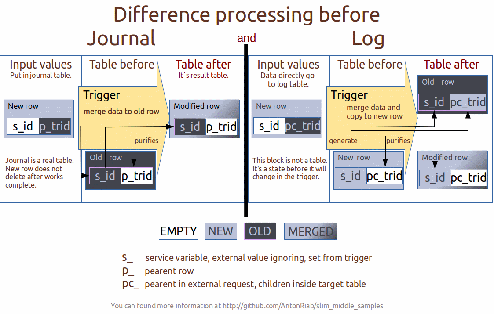

About
===============
It's samples how to make server side of absolute web app with stack on nginx->ngx_pgcopy->postgresql without any other extendeds. Without FastCGI, *CGI infrastructure and others. Like php, node.js, perl, ruby and other...  

A long time ago in a galaxy far, far away...When browsers was not have full featured JavaScript and database engine was not supports user defined functions all developers used fat middle. But currently, time is changed and we need to change.

Why it can be interesting for you. And where it is perspective?
---------------
- It's faster for execute and need less memory.
- Less code to write app.
- More native security.
- Clear division FrontEnd and BackEnd.
- Division data and viewers.
- Highload architecture.

What skills you need to have, to understand it?
---------------
Basic:
- SQL(PostgreSQL) for basic logic at BackEnd
- nginx configuration
- JavaScript for FrontEnd(current samples does not contain)

Advanced:
- plpgSQL(PostgreSQL) for more logic at BackEnd
- plperl(PostgreSQL) for BackEnd external operations
- regexp(nginx/pcre) for filters and to avoidance injections

Basics
===============
First of you need to move server side logic to user defined functions in PostgreSQL.

Import/Export work under [sql-COPY query](http://www.postgresql.org/docs/9.5/static/sql-copy.html) wrapper.
- STDOUT for output
- STDIN for CSV input
- client_body_in_file_only nginx configuration for JSON and XML input

You can found data samples of input/output in directory `sample data` at current project.  
The samples have next basic nginx configurations...  

import.export.nginx.conf
---------------
Current samples contains how to use PostgreSQL build-in functions to work with the nginx file buffer to direct put and get your data to/from database.  

With next work urls

        http://127.0.0.1:8880/csv/simple_data
        http://127.0.0.1:8880/json/simple_data
        http://127.0.0.1:8880/xml/simple_data
        http://127.0.0.1:8880/t/simple_data/*
        http://127.0.0.1:8880/t/simple_data/s_id

Parser storable function contains in `1.import.export.sql`  
And how to direct output data in the formats.

filters.nginx.conf
---------------
It's contains how to construct filters  
With next work urls like

        http://127.0.0.1:8880/t/simple_data/*?s_id=1

In current time nginx does not support sed syntax with modificator `g` like `sed s/good/bad/g`  
So, we gеt some monstrous construction in sample configuration. But it's worked.

Logic point enter of data
===============
PostgreSQL COPY request does not support direct calls storage function(only with nested `SELECT`).  
I offer to use trigger with some enter tables. Journal pair tables or one Logic table.  
Per one data type collection(structure type) for one(two if journal) table.

Logic of this contains in `2.jrl.log.sql`  

Triggers will called in order by name. I propose to make triggers from prefix trg_0 to trg_4 only for safety control. And trg_5 to trg_9 for application logic. Nine triggers is enough.

External calls
===============
Use $request_body_file и plperlu and adapted next code for your needs:

        CREATE OR REPLACE FUNCTION foo(filename TEXT) RETURNS TEXT AS $$
            return `/bin/echo -n "hello world!"`;
        $$ LANGUAGE plperlu;

SQL files
===============
PostgreSQL storage function, that you can need in your app.

        1.import.export.sql
        2.jrl.log.sql

How to look at it and install
===============
You nedd to install 
- postgresql-9.6
- postgresql-contrib-9.6
- pcre 8.3*

Then you need to build nginx with ngx_pgcopy and `make install_db`.

Lazy mode
---------------
You can use `make likeiamlazy`, to download nginx+ngx_pgcopy, build it and to run from local directory and it install sql sript.  
After you can use `make show` to look at demo work. Or part of this `import_export_show`, `filter_show` and `journal_log_show`.

**Resolve some difficult with starts:** It you tried to `make show` with nginx without ngx pgcopy, you need to remove ngx execute in current project directory.

Attention
---------------
`make install_db` install database with name `testdb` and user `testuser` with password `123`.  
`make cleanall` remove this databse and the user.

PostgreSQL need base in `/var/lib/postgresql/9.6/main`.
`make install_db` will create directory `import` inside it.

License
======
    This module is licensed under the BSD license.

    Copyright (c) 2016, by Anton Riabchevskiy (AntonRiab) <riab765@gmail.com>
    All rights reserved.

    Redistribution and use in source and binary forms, with or without
    modification, are permitted provided that the following conditions
    are met:
    1. Redistributions of source code must retain the above copyright
       notice, this list of conditions and the following disclaimer.
    2. Redistributions in binary form must reproduce the above copyright
       notice, this list of conditions and the following disclaimer in the
       documentation and/or other materials provided with the distribution.

    THIS SOFTWARE IS PROVIDED BY THE COPYRIGHT HOLDERS AND CONTRIBUTORS
    "AS IS" AND ANY EXPRESS OR IMPLIED WARRANTIES, INCLUDING, BUT NOT
    LIMITED TO, THE IMPLIED WARRANTIES OF MERCHANTABILITY AND FITNESS FOR
    A PARTICULAR PURPOSE ARE DISCLAIMED. IN NO EVENT SHALL THE COPYRIGHT
    HOLDERS OR CONTRIBUTORS BE LIABLE FOR ANY DIRECT, INDIRECT, INCIDENTAL,
    SPECIAL, EXEMPLARY, OR CONSEQUENTIAL DAMAGES (INCLUDING, BUT NOT
    LIMITED TO, PROCUREMENT OF SUBSTITUTE GOODS OR SERVICES; LOSS OF USE,
    DATA, OR PROFITS; OR BUSINESS INTERRUPTION) HOWEVER CAUSED AND ON ANY
    THEORY OF LIABILITY, WHETHER IN CONTRACT, STRICT LIABILITY, OR TORT
    (INCLUDING NEGLIGENCE OR OTHERWISE) ARISING IN ANY WAY OUT OF THE USE
    OF THIS SOFTWARE, EVEN IF ADVISED OF THE POSSIBILITY OF SUCH DAMAGE.

See also
===============
- [ngx_pgcopy](https://github.com/AntonRiab/ngx_pgcopy)
- [nginx](https://github.com/nginx/nginx)

