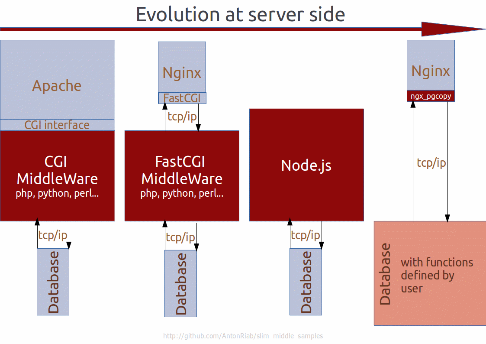

Table of Contents
=================
* [About](#about)
* [How to look at it](#how-to-look-at-it)
* [Full stack demo](#full-stack-demo-application)
* [Logic point enter of data](#logic-point-enter-of-data)
    * [PUT for WRITE AND UPDATE](#put-for-write-and-update)
    * [GET for READ](#get-for-read)
    * [How to tests regexp filters](#how-to-tests-regexp-filters)
    * [External calls](#external-calls)
* [How to adapteted your app](#how-to-adapteted-your-app)
* [URL in demo samples](#url-in-demo-samples)
* [SQL files for your app](#sql-files-for-your-app)
* [Copyright and License](#copyright-and-License)
* [See also](#see-also)

About
====
It's samples how to make server side of absolute web app with stack on nginx->ngx_pgcopy->postgresql without any other extendeds. Without FastCGI, *CGI infrastructure and others. Like php, node.js, perl, ruby and other...  

A long time ago in a galaxy far, far away...When browsers was not has full featured JavaScript and database engine was not supports user defined functions all developers used fat middle. But currently, time is changed and we need to change.

Why it can be interesting for you. And where it is perspective?
---------------
- It's faster for execute and need less memory.
- Less code to write app.
- More native security.
- Clear division FrontEnd and BackEnd.
- Division data and viewers.
- Highload architecture.

What skills you need to have, to understand it?
---------------
- SQL(PostgreSQL plpgSQL) for basic logic at BackEnd
- nginx configuration(nginx/pcre) for filters and to avoidance injections
- JavaScript for FrontEnd
- plperl(PostgreSQL) for BackEnd external operations

How to look at it
====
You need in your system before use it
- postgresql-9.6
- postgresql-contrib-9.6
- pcre 8.3* develop version
- libpq develop version

- curl for show and tests

Then you need to build nginx with ngx_pgcopy and `make install_db`.

Lazy mode
---------------
You can use `make likeiamlazy`, to download nginx+ngx_pgcopy, build it and to run from local directory and it will installed sql script.  
After you can use `make show` to look at demo work. Or part of this `import_export_show`, `filter_show` and `journal_log_show`.

**Resolve some difficult with starts:** It you tried to `make show` with nginx without ngx pgcopy, you need to remove ngx_execute in current project directory.

Attention
---------------
`make install_db`(it calls from lazy mode) installs database with name `testdb` and user `testuser` with password `123`.  
`make cleanall` removes this database and the user.

PostgreSQL needs base in `/var/lib/postgresql/9.6/main`.  
`make install_db` will create directory `import` inside it.  

I recommend to runed it in sandbox.

Full stack demo application
====
You can found in `full_stack_app` directory. It based at  
* [journal tables](#logic-point-enter-of-data) in database BackEnd.
* [knockout](http://knockoutjs.com) in FrontEnd. Like the simple todo app, from [http://learn.knockoutjs.com](http://learn.knockoutjs.com/#/?tutorial=loadingsaving)  
Before tests it run 

        sudo -u postgres psql -f c full_stack_app/0.init.psql
        PGPASSWORD='123' psql -U testuser -d testdb -h 127.0.0.1 -c -f full_stack_app/1.init.sql

And configure nginx.conf for `client_body_temp_path` to database directory and root of location `/` for www directory.

Logic point enter of data
====
PostgreSQL COPY request does not supports direct calls storage function(only with nested `SELECT`).  
I offer to devide all operations for WRITE-UPDATE by PUT and READ by GET.

PUT for WRITE AND UPDATE
---------------
Use triggesr with some enter tables. Journal pair tables or one Logic table.  
Per one data type collection(structure type) for one(two if journal) table.  

Logic of this contains in `sql/2.jrl.log.sql`  
nginx.conf sample you can found in directory `nginx.conf/journal.log.nginx.conf`.  

Triggers will called in order by name. I propose to make triggers from prefix trg_0 to trg_4 only for safety control. And trg_5 to trg_9 for application logic. Nine triggers for one table is enough.

GET for READ
---------------
You need to wrap SELECT request into COPY TO STDOUT. Filters WHERE you can construct by url args with regular expressions. Next examples do equivalent work
- native map `nginx.conf/filters.nginx.conf`
- lua module `nginx.conf/lua.filters.nginx.conf`
- perl module `nginx.conf/perl.filters.nginx.conf`
- nginScript module `nginx.conf/njs.filters.nginx.conf` with `nginx.conf/SourceJavaScript.js`

Native map have limit for 4 filters of equality. Others do not have limits for args.

How to tests regexp filters
---------------
Use `return 200 $filter` in nginx.conf location.
curl for get, and diff for compare with reference. Full example in regex test.

External calls
---------------
For image resize, make archive and other external operations...
Use $request_body_file и plperlu and adapted next code for your needs:

        CREATE OR REPLACE FUNCTION foo(filename TEXT) RETURNS TEXT AS $$
            return `/bin/echo -n "hello world!"`;
        $$ LANGUAGE plperlu;

How to adapteted your app
====
First of you need to move server side logic to user defined functions in PostgreSQL.

Import/Export work under [sql-COPY query](http://www.postgresql.org/docs/9.5/static/sql-copy.html) wrapper.
- STDOUT for output
- STDIN for CSV input
- client_body_in_file_only nginx configuration for JSON and XML input

You can found data samples of input/output in directory `sample data` at current project.  

URL in demo samples
====
import.export.nginx.conf
---------------
Current samples contains how to use PostgreSQL build-in functions to work with the nginx file buffer to direct put and get your data to/from database.  

With next urls

        http://127.0.0.1:8880/csv/simple_data
        http://127.0.0.1:8880/json/simple_data
        http://127.0.0.1:8880/xml/simple_data
        http://127.0.0.1:8880/t/simple_data/*
        http://127.0.0.1:8880/t/simple_data/s_id

Parser storable function contains in `1.import.export.sql`  
And how to direct output data in the formats.

filters.nginx.conf, lua, perl and njs
---------------
It's contains how to construct filters  
With next urls like

        http://127.0.0.1:8880/t/simple_data/*?s_id=1

Native `map` in current time does not supports sed syntax with modificator `g` like `sed s/good/bad/g`  
So, it gеt some monstrous construction and limits. **Other filters limitless.**

SQL files for your app
===============
PostgreSQL storage function, that you can need in your app.

        1.import.export.sql
        2.jrl.log.sql

Copyright and License
======
    This module is licensed under the BSD license.

    Copyright (c) 2017, by Anton Riabchevskiy (AntonRiab) <riab765@gmail.com>
    All rights reserved.

    Redistribution and use in source and binary forms, with or without
    modification, are permitted provided that the following conditions
    are met:
    1. Redistributions of source code must retain the above copyright
       notice, this list of conditions and the following disclaimer.
    2. Redistributions in binary form must reproduce the above copyright
       notice, this list of conditions and the following disclaimer in the
       documentation and/or other materials provided with the distribution.

    THIS SOFTWARE IS PROVIDED BY THE COPYRIGHT HOLDERS AND CONTRIBUTORS
    "AS IS" AND ANY EXPRESS OR IMPLIED WARRANTIES, INCLUDING, BUT NOT
    LIMITED TO, THE IMPLIED WARRANTIES OF MERCHANTABILITY AND FITNESS FOR
    A PARTICULAR PURPOSE ARE DISCLAIMED. IN NO EVENT SHALL THE COPYRIGHT
    HOLDERS OR CONTRIBUTORS BE LIABLE FOR ANY DIRECT, INDIRECT, INCIDENTAL,
    SPECIAL, EXEMPLARY, OR CONSEQUENTIAL DAMAGES (INCLUDING, BUT NOT
    LIMITED TO, PROCUREMENT OF SUBSTITUTE GOODS OR SERVICES; LOSS OF USE,
    DATA, OR PROFITS; OR BUSINESS INTERRUPTION) HOWEVER CAUSED AND ON ANY
    THEORY OF LIABILITY, WHETHER IN CONTRACT, STRICT LIABILITY, OR TORT
    (INCLUDING NEGLIGENCE OR OTHERWISE) ARISING IN ANY WAY OUT OF THE USE
    OF THIS SOFTWARE, EVEN IF ADVISED OF THE POSSIBILITY OF SUCH DAMAGE.

See also
===============
- [ngx_pgcopy](https://github.com/AntonRiab/ngx_pgcopy)
- [nginx](https://github.com/nginx/nginx)
- [lua module](https://github.com/openresty/lua-nginx-module)
- [perl module](http://search.cpan.org/~zzz/Nginx-Perl-1.8.1.10/src/http/modules/perl/Nginx.pm)
- [nginScript module](http://hg.nginx.org/njs)

